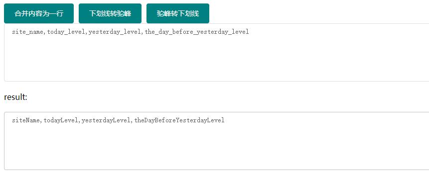

# developer-toolkit
## Build
### Project setup
The version of nodejs is v16.17.0
```
npm install
```

#### Compiles and hot-reloads for development
```
npm run serve
```

#### Compiles and minifies for production
```
npm run build
```

#### Customize configuration
See [Configuration Reference](https://cli.vuejs.org/config/).

## Example
under line to came  


根据模板和参数生成SQL
